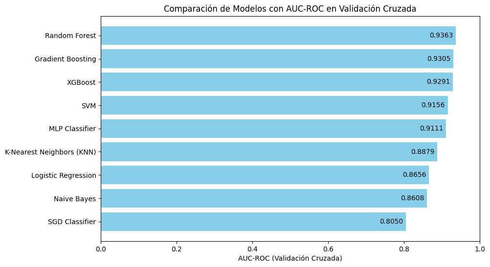
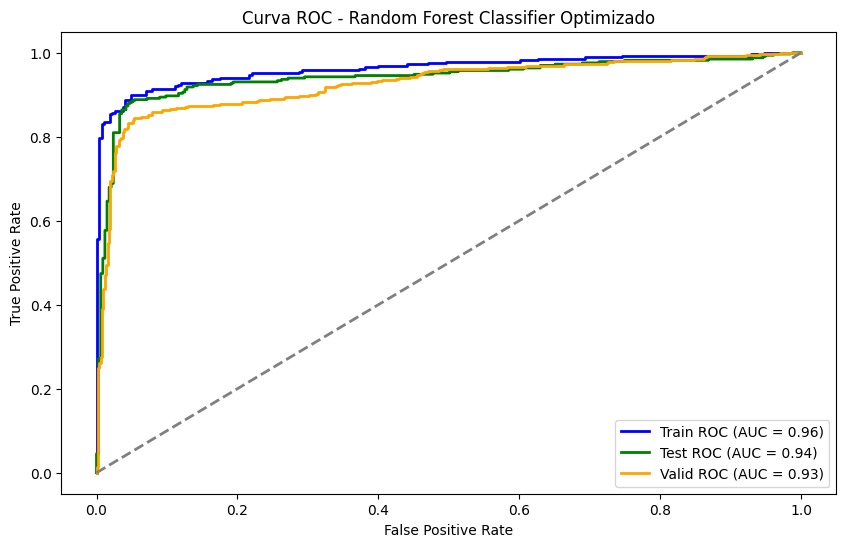
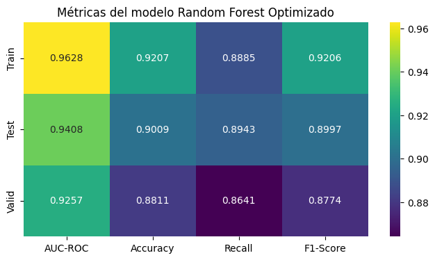
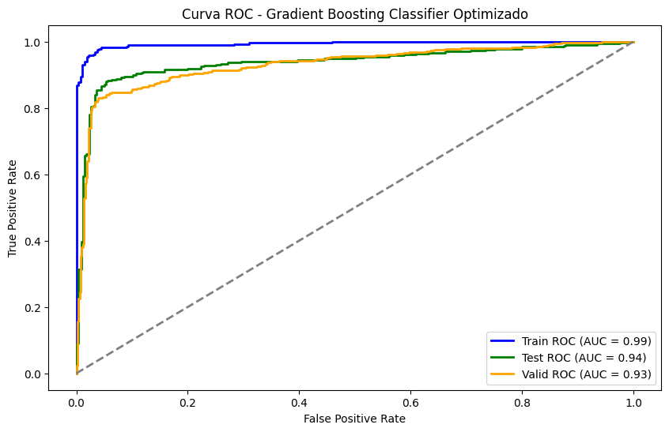
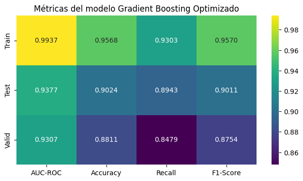
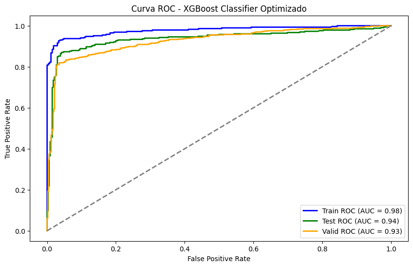
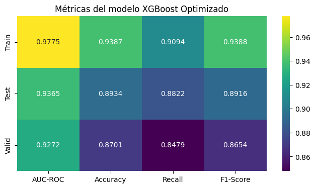
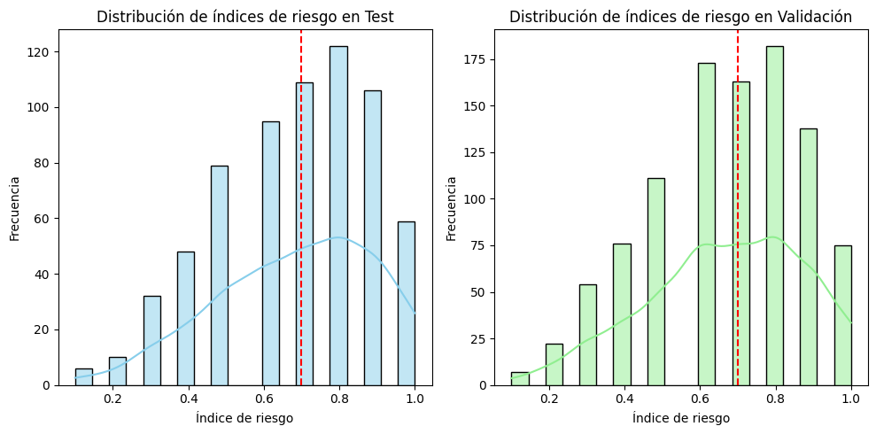

## Alzheimers Project

En este estudio se evaluaron los tres modelos de clasificación más prometedores para predecir la probabilidad de Alzheimer a partir de información clínica y resultados de exámenes médicos. Se utilizó el AUC-ROC como métrica principal debido a su capacidad para evaluar la discriminación del modelo sin depender de un umbral de clasificación fijo.

#### Resultados Iniciales (sin optimización)
- **Random Forest:** F1-Score = 0.9033  
- **XGBoost:** F1-Score = 0.8778
- **Gradient Boosting Classifier:** F1-Score = 0.8711  

---

#### Random Forest Optimizado
- **Entrenamiento:** F1_Score = 0.9187  
- **Prueba:** F1_Score = 0.8921  
- **Validación:** F1_Score = 0.8686  

Este modelo muestra un desempeño sólido y consistente, con una ligera disminución del F1_Score de entrenamiento a validación, lo cual es normal y sugiere buena capacidad de generalización.

---

#### Gradient Boosting Optimizado
- **Entrenamiento:** F1_Score = 0.9077  
- **Prueba:** F1_Score = 0.9073  
- **Validación:** F1_Score = 0.8805  

Aunque el modelo presenta un F1_Score casi perfecto en entrenamiento, la diferencia con los conjuntos de prueba y validación indica un posible sobreajuste, lo que podría limitar su desempeño en datos nuevos.

---

#### XGBoost Optimizado
- **Entrenamiento:** F1_Score = 0.9458  
- **Prueba:** F1_Score = 0.8973  
- **Validación:** F1_Score = 0.8712  

Este modelo ofrece buenos resultados en general, aunque sus métricas en validación son ligeramente inferiores a las obtenidas por el modelo Random Forest optimizado.

---

#### Selección del Modelo Final

Considerando la consistencia de los resultados en entrenamiento, prueba y validación, **el modelo Gradient Boosting Optimizado** se destaca por su equilibrio y robustez. Con un 1_Score = 0.9077  en entrenamiento, F1_Score = 0.9073  en prueba y F1_Score = 0.8805  en validación, este modelo demuestra una sólida capacidad de generalización y se escoge como la opción final para predecir qué pacientes podrían tener Alzheimer a partir de la información clínica y de exámenes médicos.

