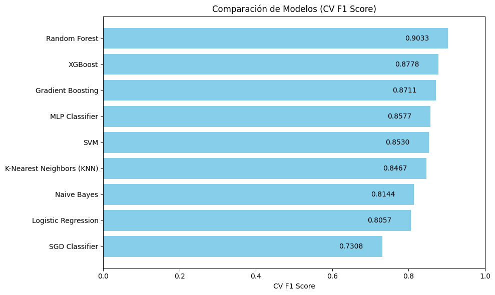

## Alzheimers Project

En este estudio se evaluaron los tres modelos de clasificación más prometedores para predecir la probabilidad de Alzheimer a partir de información clínica y resultados de exámenes médicos. Se utilizó el AUC-ROC como métrica principal debido a su capacidad para evaluar la discriminación del modelo sin depender de un umbral de clasificación fijo.

#### Resultados Iniciales (sin optimización)
- **Random Forest:** AUC-ROC = 0.9363  
- **Gradient Boosting Classifier:** AUC-ROC = 0.9305  
- **XGBoost:** AUC-ROC = 0.9291

---

#### Random Forest Optimizado
- **Entrenamiento:** AUC-ROC = 0.9629  
- **Prueba:** AUC-ROC = 0.9408  
- **Validación:** AUC-ROC = 0.9257  

Este modelo muestra un desempeño sólido y consistente, con una ligera disminución del AUC-ROC de entrenamiento a validación, lo cual es normal y sugiere buena capacidad de generalización.

---

#### Gradient Boosting Optimizado
- **Entrenamiento:** AUC-ROC = 0.9937  
- **Prueba:** AUC-ROC = 0.9377  
- **Validación:** AUC-ROC = 0.9307  

Aunque el modelo presenta un AUC-ROC casi perfecto en entrenamiento, la diferencia con los conjuntos de prueba y validación indica un posible sobreajuste, lo que podría limitar su desempeño en datos nuevos.

---

#### XGBoost Optimizado
- **Entrenamiento:** AUC-ROC = 0.9775  
- **Prueba:** AUC-ROC = 0.9365  
- **Validación:** AUC-ROC = 0.9272  

Este modelo ofrece buenos resultados en general, aunque sus métricas en validación son ligeramente inferiores a las obtenidas por el modelo Random Forest optimizado.

---

#### Selección del Modelo Final

Considerando la consistencia de los resultados en entrenamiento, prueba y validación, **el modelo Random Forest optimizado** se destaca por su equilibrio y robustez. Con un AUC-ROC de 0.9629 en entrenamiento, 0.9408 en prueba y 0.9257 en validación, este modelo demuestra una sólida capacidad de generalización y se escoge como la opción final para predecir qué pacientes podrían tener Alzheimer a partir de la información clínica y de exámenes médicos.

